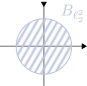
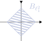
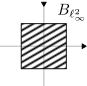

+++
title = "Linear Analysis"
description = "Normed and Banach spaces, Baire category theorem & applications, spaces of continuous functions, Hilbert spaces, spectral theory."

[extra]
part = "Part II"
term = "Mich"
year = "2025"
lecturer = "Dr András Zsák"
color = "#e4564922"
image = "notes/linear-analysis/thumbnail.svg"
unfinished = true
+++

## Normed Spaces

### Definitions and examples


Let $X$ be a (real or complex) vector space. A **norm** on $X$ is a function $\lVert \cdot \rVert : X \to \mathbb{R}$ such that

1. $\lVert x \rVert \geq 0 \quad \forall x \in X$, with equality iff $x = 0$ &nbsp;(positivity);
2. $\lVert \lambda x \rVert = |\lambda|\ \lVert x \rVert \quad \forall x \in X$ and scalars $\lambda$ &nbsp;(homogeneity);
3. $\lVert x + y \rVert \leq \lVert x \rVert + \lVert y \rVert \quad \forall x, y \in X$ &nbsp;(triangle inequality).

$\lVert x \rVert$ is called the **norm** or **length** of $x$.

A **normed space** is a pair $(X, \lVert \cdot \rVert)$ where $X$ is a vector space and $\lVert \cdot \rVert$ is a norm on $X$.


#### Examples



1. $\ell_2^n = (\mathbb{R}^n, \lVert \cdot \rVert_2)$ (or $(\mathbb{C}^n, \lVert \cdot \rVert_2)$), where
   $$\lVert x \rVert_2 = \left(\sum_{i=1}^n |x_i|^2 \right)^{1/2}$$
   for $x = (x_1, \dots, x_n) \in \mathbb{R}^n$ (the **$\ell_2$-norm** or **Euclidean norm**).

   Check the three properties: (i), (ii) are easy; (iii) follows from Cauchy–Schwarz.

2. $\ell_1^n = (\mathbb{R}^n, \lVert \cdot \rVert_1)$, where $\lVert x \rVert_1 = \sum_{i=1}^n |x_i|$ (the **$\ell_1$-norm**).

   (i), (ii) easy; (iii): $|x_i + y_i| \leq |x_i| + |y_i|$, sum over $i$.

3. $\ell_{\infty}^n = (\mathbb{R}^n, \lVert \cdot \rVert_{\infty})$, where $\lVert x \rVert_{\infty} = \max_{1 \leq i \leq n} |x_i|$ (the **$\ell_{\infty}$-norm** or **sup-norm**).

   (i), (ii), (iii) easy.



Given a normed space $X$, its norm $\lVert \cdot \rVert$ induces a metric $d$ on $X$:
$$d(x,y) = \lVert x-y \rVert$$



$d(x,y) \geq 0, =0 \iff x-y = 0 \iff x=y \quad \checkmark$

$d(y,x) = \lVert y-x \rVert = \lVert (-1)(x-y) \rVert = \lVert x-y \rVert = d(x,y) \quad \checkmark$

$d(x,z) = \lVert x-z \rVert = \lVert (x-y)-(y-z) \rVert \leq \lVert x-y \rVert + \lVert y-z \rVert = d(x,y) + d(y,z) \quad\checkmark$



Then $d$ induces a topology on $X$ called the **norm topology** of $X$. We can now talk about continuity e.g. the algebraic operations are (sequentially) continuous:

- If $x_n \to x, y_n \to y$ in $X$ then $x_n + y_n \to x+y$
- If $x_n \to x, \lambda_n \to \lambda$ in scalar field, then $\lambda_n x_n \to \lambda x$.

Also the norm $\lVert \cdot \rVert : X \to \mathbb{R}$ is continuous since $\Big| \lVert x \rVert - \lVert y \rVert \Big| \leq \lVert x-y \rVert$ by reverse triangle inequality, so $\lVert \cdot \rVert$ is even 1-Lipschitz.


A **Banach space** is a complete normed space, i.e. a normed space that is complete in its norm topology.


For example, $\ell_2^n, \ell_1^n, \ell_\infty^n$ are complete, because we can look coordinate-wise: $x^{(k)} \to x$ in one of these spaces $\iff x_i^{(k)} \to x_i \\;\forall\\; 1 \leq i \leq n$, and $(x^{(k)})\_{k=1}^\infty$ is Cauchy iff $(x_i^{(k)})\_{k=1}^\infty$ is Cauchy for each $i = 1, \dots, n$.

In a normed space $X$, a useful object is the **unit ball** $B_X = \\{ x \in X \mid \lVert x \rVert \leq 1\\}$.

  
  
  


It might just be me, but the axes seem all wonky...


#### Remarks

- $B_X$ determines the norm: $\lVert x \rVert = \inf\\{ t \geq 0 \mid x \in t B_X\\}$.
- $B_X$ is symmetric, convex, and closed: $x \in B_X \iff -x \in B_X$, and if $x,y \in B_X, t \in [0,1]$, then $(1-t)x + ty \in B_X$, since $\lVert (1-t)x + ty\rVert \leq (1-t)\lVert x \rVert + t \lVert y \rVert \leq 1$.
- If $B \subset \mathbb{R}^n$ is a closed, convex, symmetric, bounded neighbourhood of 0, then $B$ is the unit ball of $(\mathbb{R}^n, \lVert \cdot \rVert)$ for some norm $\lVert \cdot \rVert$.

#### More Examples


4. $\ell_p^n = (\mathbb{R}^n, \lVert \cdot \rVert_p)$, where $1 \leq p < \infty$, $\lVert x \rVert_p = \left(\sum_{i=1}^n |x_i|^p\right)^{1/p}$ (the **$\ell_p$-norm**).

    (i), (ii) easy, (iii) not obvious (see "Minkowski's inequality" later).

5. Let $S$ denote the set of all scalar sequences. This is a vector space in the coordinate-wise operations: $(x_n) + (y_n) = (x_n + y_n), \lambda \cdot (x_n) = (\lambda x_n)$.

    $\ell_1 = \\{(x_n) \in S \mid \sum_{n=1}^{\infty} |x_n| < \infty\\},\\; \lVert (x_n) \rVert_1 = \sum_{n=1}^\infty |x_n|$ (the **$\ell_1$-norm**).

