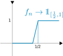

+++
title = "Linear Analysis"
description = "Normed and Banach spaces, Baire category theorem & applications, spaces of continuous functions, Hilbert spaces, spectral theory."

[extra]
part = "Part II"
term = "Mich"
year = "2025"
lecturer = "Dr András Zsák"
color = "#e4564922"
image = "notes/linear-analysis/thumbnail.svg"
unfinished = true
+++

## Normed Spaces

### Definitions and examples


Let $X$ be a (real or complex) vector space. A **norm** on $X$ is a function $\lVert \cdot \rVert : X \to \mathbb{R}$ such that

1. $\lVert x \rVert \geq 0 \quad \forall x \in X$, with equality iff $x = 0$ &nbsp;(positivity);
2. $\lVert \lambda x \rVert = |\lambda|\ \lVert x \rVert \quad \forall x \in X$ and scalars $\lambda$ &nbsp;(homogeneity);
3. $\lVert x + y \rVert \leq \lVert x \rVert + \lVert y \rVert \quad \forall x, y \in X$ &nbsp;(triangle inequality).

$\lVert x \rVert$ is called the **norm** or **length** of $x$.

A **normed space** is a pair $(X, \lVert \cdot \rVert)$ where $X$ is a vector space and $\lVert \cdot \rVert$ is a norm on $X$.


#### Examples



1. $\ell_2^n \coloneqq (\mathbb{R}^n, \lVert \cdot \rVert_2)$ (or $(\mathbb{C}^n, \lVert \cdot \rVert_2)$), where
    $$\lVert x \rVert_2 \coloneqq \left(\sum_{i=1}^n |x_i|^2 \right)^{1/2}$$
    for $x = (x_1, \dots, x_n) \in \mathbb{R}^n$ (the **$\ell_2$-norm** or **Euclidean norm**).

    Check the three properties: (i), (ii) are easy; (iii) follows from Cauchy–Schwarz.

2. $\ell_1^n \coloneqq (\mathbb{R}^n, \lVert \cdot \rVert_1)$, where $\lVert x \rVert_1 \coloneqq \sum_{i=1}^n |x_i|$ (the **$\ell_1$-norm**).

    (i), (ii) easy; (iii): $|x_i + y_i| \leq |x_i| + |y_i|$, sum over $i$.

3. $\ell_{\infty}^n \coloneqq (\mathbb{R}^n, \lVert \cdot \rVert_{\infty})$, where $\lVert x \rVert_{\infty} \coloneqq \max_{1 \leq i \leq n} |x_i|$ (the **$\ell_{\infty}$-norm** or **sup-norm**).

    (i), (ii), (iii) easy.



Given a normed space $X$, its norm $\lVert \cdot \rVert$ induces a metric $d$ on $X$:
$$d(x,y) = \lVert x-y \rVert$$



$d(x,y) \geq 0, =0 \iff x-y = 0 \iff x=y \quad \checkmark$

$d(y,x) = \lVert y-x \rVert = \lVert (-1)(x-y) \rVert = \lVert x-y \rVert = d(x,y) \quad \checkmark$

$d(x,z) = \lVert x-z \rVert = \lVert (x-y)-(y-z) \rVert \leq \lVert x-y \rVert + \lVert y-z \rVert = d(x,y) + d(y,z) \quad\checkmark$



Then $d$ induces a topology on $X$ called the **norm topology** of $X$. We can now talk about continuity e.g. the algebraic operations are (sequentially) continuous:

- If $x_n \to x, y_n \to y$ in $X$ then $x_n + y_n \to x+y$
- If $x_n \to x, \lambda_n \to \lambda$ in scalar field, then $\lambda_n x_n \to \lambda x$.

Also the norm $\lVert \cdot \rVert : X \to \mathbb{R}$ is continuous since $\Big| \lVert x \rVert - \lVert y \rVert \Big| \leq \lVert x-y \rVert$ by reverse triangle inequality, so $\lVert \cdot \rVert$ is even 1-Lipschitz.


A **Banach space** is a complete normed space, i.e. a normed space that is complete in its norm topology.


For example, $\ell_2^n, \ell_1^n, \ell_\infty^n$ are complete, because we can look coordinate-wise: $x^{(k)} \to x$ in one of these spaces $\iff x_i^{(k)} \to x_i \\;\forall\\; 1 \leq i \leq n$, and $(x^{(k)})\_{k=1}^\infty$ is Cauchy iff $(x_i^{(k)})\_{k=1}^\infty$ is Cauchy for each $i = 1, \dots, n$.

In a normed space $X$, a useful object is the **unit ball** $B_X \coloneqq \\{ x \in X \mid \lVert x \rVert \leq 1\\}$.

  
  
  


It might just be me, but the axes seem all wonky...


#### Remarks

- $B_X$ determines the norm: $\lVert x \rVert = \inf\\{ t \geq 0 \mid x \in t B_X\\}$.
- $B_X$ is symmetric, convex, and closed: $x \in B_X \iff -x \in B_X$, and if $x,y \in B_X, t \in [0,1]$, then $(1-t)x + ty \in B_X$, since $\lVert (1-t)x + ty\rVert \leq (1-t)\lVert x \rVert + t \lVert y \rVert \leq 1$.
- If $B \subset \mathbb{R}^n$ is a closed, convex, symmetric, bounded neighbourhood of 0, then $B$ is the unit ball of $(\mathbb{R}^n, \lVert \cdot \rVert)$ for some norm $\lVert \cdot \rVert$.

#### More Examples


4. $\ell_p^n \coloneqq (\mathbb{R}^n, \lVert \cdot \rVert_p)$, where $1 \leq p < \infty$, $\lVert x \rVert_p \coloneqq \left(\sum_{i=1}^n |x_i|^p\right)^{1/p}$ (the **$\ell_p$-norm**).

    (i), (ii) easy, (iii) not obvious (done later; see {{ref(label="minkowski")}}).

5. Let $S$ denote the set of all scalar sequences. This is a vector space in the coordinate-wise operations: $(x_n) + (y_n) = (x_n + y_n), \lambda \cdot (x_n) = (\lambda x_n)$.

    $\ell_1 \coloneqq \Big\\{(x_n) \in S \\;\Big|\\; \sum_{n=1}^{\infty} |x_n| < \infty\Big\\},\\; \lVert (x_n) \rVert_1 \coloneqq \sum_{n=1}^\infty |x_n|$ (the **$\ell_1$-norm**).

    (i), (ii) easy. (iii): given $x = (x_n), y = (y_n) \in \ell_1$,

    - $|x_n + y_n| \leq |x_n| + |y_n| \\;\forall\\; n \in \mathbb{N}$.
    - Sum over $n \in \mathbb{N}$ to get that $x + y \in \mathbb{\ell_1}$ and $\lVert x + y \rVert_1 \leq \lVert x \rVert_1 + \lVert y \rVert_1$.

    So $\ell_1$ is a subspace of $S$ and $\lVert \cdot \rVert_1$ is a norm on $\ell_1$.

6. $\ell_2 \coloneqq \Big\\{(x_n) \in S \\;\Big|\\; \sum_{n=1}^{\infty} |x_n|^2 < \infty\Big\\},\\; \lVert (x_n) \rVert_2 \coloneqq \left(\sum_{n=1}^\infty |x_n|^2 \right)^{1/2}$ (the **$\ell_2$-norm**).

    (i), (ii) easy. (iii): given $x = (x_n), y = (y_n) \in \ell_2$,

    - $\left(\sum_{k=1}^n |x_k+y_k|^2\right)^{1/2} \leq \left(\sum_{k=1}^n |x_k|^2\right)^{1/2} + \left(\sum_{k=1}^n |y_k|^2\right)^{1/2}$ by triangle inequality in $\ell_2^n$.
    - Let $n \to \infty$: get that $x + y \in \mathbb{\ell_2}$ and $\lVert x + y \rVert_2 \leq \lVert x \rVert_2 + \lVert y \rVert_2$.

    So $\ell_2$ is a subspace of $S$ and $\lVert \cdot \rVert_2$ is a norm on $\ell_2$.

    More generally, for $1 \leq p < \infty$, $\ell_p \coloneqq \Big\\{(x_n) \in S \mid \sum_{n=1}^\infty |x_n|^p < \infty \Big\\}$ is a subspace of $S$ and $\lVert (x_n) \rVert_p \coloneqq \left(\sum_{n=1}^\infty |x_n|^p \right)^{1/p}$ is a norm (the **$\ell_p$-norm**) on $\ell_p$ (once we have the triangle inequality in $\ell_p^n$, which we will do soon; see {{ref(label="minkowski")}}).

7. $\ell_\infty \coloneqq \Big\\{(x_n) \in S \\;\Big|\\; \exists M \geq 0 \quad \forall n \quad |x_n| \leq M \Big\\},\\; \lVert (x_n) \rVert_\infty \coloneqq \sup_{n \in \mathbb{N}} |x_n|$ (the **$\ell_\infty$-norm** or **sup-norm**).

    (i), (ii) easy. (iii): given $x = (x_n), y = (y_n) \in \ell_\infty$,

    - $|x_n + y_n| \leq |x_n| + |y_n| \leq \lVert x \rVert_\infty + \lVert y \rVert_\infty \\;\forall\\; n \in \mathbb{N}$.
    - So $x+y \in \ell_\infty$ and $\lVert x+y \rVert_\infty \leq \lVert x \rVert_\infty + \lVert y \rVert_\infty$.

8. $c_0 \coloneqq \Big\\{(x_n) \in S \\;\Big|\\; x_n \to 0 \text{ as } n \to \infty \Big\\}$

    $c \coloneqq \Big\\{(x_n) \in S \\;\Big|\\; \lim_{n \to \infty} x_n \text{ exists} \Big\\}$

    These are subspaces of $\ell_\infty$ and hence normed spaces in $\lVert \cdot \rVert_\infty$.



Examples 5-8 are called **sequence spaces**. They are "infinite-dimensional analogues" of examples 1-4.

### Inequalities of Minkowski and Hölder


We aim at proving these two ubiquitous inequalities. Minkowski is just the triangle inequality for $\ell_p^n$, and Hölder is a generalisation of Cauchy-Schwarz.


Recall that a function $f : (0, \infty) \to \mathbb{R}$ is **convex** if
$$f((1-t)x+ty) \leq (1-t)f(x) + tf(y) \\;\forall\\; x,y \in (0,\infty) \\;\forall\\; t \in [0,1]$$
and **concave** if $\geq$.


Let $1 \leq p < \infty$. Then $x \mapsto x^p: (0,\infty) \to \mathbb{R}$ is convex.




We need to show $((1-t)x + ty)^p \leq (1-t)x^p + ty^p \\;\forall\\; x,y \in (0,\infty) \\;\forall\\; t \in [0,1]$.

Fix $y > 0, t \in [0,1]$. Define $g(x)$ to be the difference:

$$g(x) = \left((1-t)x + ty\right)^p - \left((1-t)x^p + ty^p\right),\quad x > 0.$$

Want $g(x) \leq 0 \\;\forall\\; x > 0$, then done.

$$g'(x) = p(1-t)\left((1-t)x + ty\right)^{p-1} - p(1-t)x^{p-1}.$$

If $0 < x < y$ then $g'(x) \geq 0$. If $y < x$ then $g'(x) \leq 0$. In either case, by MVT have $g(x) \leq g(y) = 0 \\;\forall\\; x \in (0, \infty)$.



Let $1 \leq p < \infty$, $n \in \mathbb{N}$. For $x,y \in \mathbb{R}^n$ (or $\mathbb{C}^n$),
$$\lVert x + y \rVert_p \leq \lVert x \rVert_p + \lVert y \rVert_p$$


(This shows that $\ell_p^n = (\mathbb{R}^n, \lVert\cdot\rVert_p)$ and $(\ell_p, \lVert\cdot\rVert_p)$ are normed spaces.)


Let $B = \\{x \in \mathbb{R}^n \mid \lVert x \rVert_p \leq 1\\}$. We will show $B$ is a convex set later (necessary). Then we complete the proof as follows:

Let $x,y \in \mathbb{R}^n$. *Need* $\lVert x+y \rVert_p \leq \lVert x \rVert_p + \lVert y \rVert_p$. WLOG $x,y,x+y$ nonzero.

$$\begin{aligned}
\frac{x+y}{\lVert x \rVert_p + \lVert y \rVert_p} &= \frac{\lVert x \rVert_p}{\lVert x \rVert_p + \lVert y \rVert_p} \cdot \frac{x}{\lVert x \rVert_p} + \frac{\lVert y \rVert_p}{\lVert x \rVert_p + \lVert y \rVert_p} \cdot \frac{y}{\lVert y \rVert_p}\\\\
& \in B \text{ since convex combination of elts of } B.
\end{aligned}$$ 

Hence $\lVert \frac{x+y}{\lVert x \rVert_p + \lVert y \rVert_p} \rVert_p \leq 1$, so $\lVert x+y \rVert_p \leq \lVert x \rVert_p + \lVert y \rVert_p \\; \checkmark$

- To show $B$ is convex: let $x,y \in B, t \in [0,1]$. *Need* $(1-t)x + ty \in B$.

    For $1 \leq k \leq n$,
    $$|(1-t)x_k + ty_k|^p \leq \left((1-t)|x_k| + t |y_k| \right)^p \leq (1-t) |x_k|^p + t|y_k|^p$$
    where the second inequality is by {{ref(label="x^p-is-convex")}} if $x_k \neq 0, y_k \neq 0$, otherwise trivial.

    Sum over $k$:

    $$\lVert (1-t)x + ty \rVert_p^p \leq (1-t) \underbrace{\lVert x \rVert_p^p}\_{\leq 1} + t \underbrace{\lVert y \rVert_p^p}\_{\leq 1} \leq 1 \\; \checkmark$$ 

    So $(1-t)x + ty \in B$.



Show that $\ell_p, 1 \leq p \leq \infty$, is complete. (Slick proof later)


Now onto Hölder.

Let $1 < p < \infty$. The **conjugate index** of $p$ is the unique $q$, $1 < q < \infty$, such that $\frac{1}{p} + \frac{1}{q} = 1$. For example if $p=2$ then $q=2$.


Let $ 1 < p,q < \infty$ with $\frac{1}{p} + \frac{1}{q} = 1$. Then $\forall a,b \geq 0,$
$$ab \leq \frac{a^p}{p} + \frac{b^q}{q}$$



WLOG $a>0, b>0$. Take log of both sides, and use concavity of log.



Let $ 1 < p,q < \infty$ with $\frac{1}{p} + \frac{1}{q} = 1$. Then for $x \in \ell_p, y \in \ell_q$, we have $x \cdot y = (x\_n y\_n) \in \ell\_1$ and
$$\lVert x \cdot y \rVert\_1 \leq \lVert x \rVert\_p \cdot \lVert y \rVert\_q$$


#### Remarks

- $p=1, q=\infty$ also works:
    - Let $x = (x_n) \in \ell_1, y = (y_n) \in \ell_\infty$. Then $\forall n$, $|x_n y_n| = |x_n| \cdot |y_n| \leq |x_n| \cdot \lVert y \rVert_\infty$.
    - So by comparison test, $x \cdot y = (x_n y_n) \in \ell_1$ and $\lVert x \cdot y \rVert_1 \leq \lVert x \rVert_1 \cdot \lVert y \rVert_\infty$.
- $p=q=2$ is Cauchy-Schwarz.


WLOG $x \neq 0, y \neq 0$. By homogeneity, WLOG $\lVert x \rVert_p = \lVert y \rVert_q = 1$.

By Young's inequality, $|x_n y_n| \leq \frac{|x_n|^p}{p} + \frac{|y_n|^q}{q} \\;\forall n$. Sum over $n$:
$$\begin{aligned}
\sum_{n=1}^\infty |x_n y_n| &\leq \frac{\lVert x \rVert_p^p}{p} + \frac{\lVert y \rVert_q^q}{q}\\\\
&= \frac{1}{p} + \frac{1}{q} = 1 = \lVert x \rVert_p \cdot \lVert y \rVert_q.
\end{aligned}$$



Deduce Minkowski from Hölder.


### More examples of normed spaces


9. $C[0,1] \coloneqq \big\\{f : [0,1] \to \mathbb{R} \mid f \text{ is continuous}\big\\}$, $\lVert f \rVert_\infty \coloneqq \sup_{x \in [0,1]} |f(x)|$ (**sup-norm** or **uniform norm**)

    This is a Banach space (recall uniform limit of cts fns is cts).

10. More generally, given a compact Hausdorff space $K$,
$$C(K) \coloneqq \big\\{f:K\to\mathbb{R} \mid f \text{ cts}\big\\}$$ 
is a Banach space in the sup-norm $\lVert f \rVert_\infty \coloneqq \sup_{x \in K} |f(x)|$.
(We will look at compact Hausdorff spaces in depth later.)

11. $C[0,1]$ with the **$L^1$-norm** $\lVert f \rVert_1 \coloneqq \int_0^1 |f(t)| dt, f \in C[0,1]$

    

      

    This is a normed space, but is incomplete:

      

      
    

    More generally, $C[0,1]$ is incomplete in the **$L^p$-norm**, $1 \leq p < \infty$, $\lVert f \rVert_p \coloneqq \left(\int_0^1 |f(t)|^p dt\right)^{1/p}$ (same counterexample).

    $\big[$ In II Prob & Measure, the completion of $\left(C[0,1], \lVert \cdot \rVert_p\right)$ is $L^p[0,1]$ $\big]$

12. $C^1[0,1] \coloneqq \big\\{ f \in C[0,1] \mid f \text{ ctsly diffble} \big\\} \subseteq C[0,1]$ is a subspace. So it's a normed space in $\lVert \cdot \rVert_\infty$, but is incomplete, i.e. not closed in $C[0,1]$.

    It *is* complete in the norm $\lVert f \rVert = \lVert f \rVert_\infty + \lVert f' \rVert_\infty$ (see example sheet 1).

13. $\Delta \coloneqq \big\\{ z \in \mathbb{C} \mid |z| \leq 1 \big\\}$

    $A(\Delta) \coloneqq \big\\{ f \in C(\Delta) \mid f \text{ analytic on int}(\Delta) \big\\}$ is a subspace of $C(\Delta)$, and a closed space [uniform limit of holomorphic fns is holomorphic], hence a Banach space in $\lVert \cdot \rVert_\infty$.



### More on the normed topology

Let $X$ be a normed space, $A \subseteq X$ subset. Recall the **closure** of $A$ is $\overline{A} = \big\\{ x \in X \mid \exists (a_n) \in A \text{ such that } a_n \to x \text{ as } n \to \infty \big\\}$.

Say $A$ is **dense** in $X$ if $\overline{A} = X$. (Equivalently, $A$ intersects every nonempty open set.)

Say $X$ is **separable** if it has a countable dense subset. (For a metric space, this is equivalent to being second countable.)

If $Y \subseteq X$ is a (vector) subspace,  then so is $\overline{Y}$: if $x,y \in \overline{Y}$, then
- $\exists (x_n), (y_n) \in Y$ s.t. $x_n \to x, y_n \to y$.
- So  $\lambda x_n + \mu y_n \to \lambda x + \mu y \in \overline{Y}$.

Similarly, if $A \subseteq X$ is convex, then so is $\overline{A}$.


For a subset $A$ of a normed space $X$, the **closed linear span** of $A$, denoted $\overline{\text{span}} A$, is $\overline{\text{span} A}$, which is a closed subspace of $X$.


Note: if $A$ is countable then $\overline{\text{span}} A$ is separable: take the set of all rational linear combinations of elements of $A$; this is countable and dense in $\overline{\text{span}A}$.

#### Examples

- $\overline{\mathbb{Q}} = \mathbb{R}$, so $\mathbb{R}$ is separable.
- $\ell_p, 1 \leq p < \infty$, is separable: let
    $$\begin{aligned}
    e\_n &\coloneqq (0, \dots, 0, \underbrace{1}\_{n^{th}\text{ space}}, 0, \dots), n \in \mathbb{R}\\\\
    c\_{00} &\coloneqq \text{span}\\{e\_n \mid n \in \mathbb{N}\\}\\\\
    &= \\{(x_n) \in S \mid x_n \text{ is eventually constantly } 0\\}
    \end{aligned}$$

    
    $c = \big\\{\text{limit exists}\big\\}$, $c_0 = \big\\{\text{limit is 0}\big\\}$, $c_{00} = \big\\{\text{eventually constantly 0}\big\\}$
    

    Then $\ell_p = \overline{\text{span}}\\{e_n \mid n \in \mathbb{N}\\}$: for $x = (x_n) \in \ell_p$, we can approximate by "matching elements left-to-right":
    $$\lVert x - \sum_{i=1}^n x_i e_i \rVert_p = \left(\sum_{i > n} |x_i|^p\right)^{1/p} \to 0 \text{ as } n \to \infty.$$

- Similarly, in $\ell_\infty$, $\overline{c_{00}} = \overline{\text{span}}\\{e_n \mid n \in \mathbb{N}\\} = c_0$ (see example sheet 1).
- $c_0$ is separable, by the above note. ($c_0 = \overline{c_{00}}$, $c_{00}$ countable)
- $\ell_\infty$ is *not* separable. (it contains unctble collection of disjoint open sets; see example sheet 1)

### Bounded linear maps


Let $X,Y$ be normed spaces and $T: X \to Y$ a linear map. The following are equivalent:
1. $T$ is cts at 0
2. $T$ is cts
3. $T$ is Lipschitz
4. T is **bounded** i.e. $\exists C \geq 0$ s.t. $\forall x \in \mathbb{X}, \lVert Tx \rVert \leq C \lVert x \rVert$



(iv) $\implies$ (iii): $\lVert Tx - Ty \rVert = \lVert T(x-y) \rVert \leq C\lVert x-y \rVert$

(iii) $\implies$ (ii): immediate

(ii) $\implies$ (i): obvious

(i) $\implies$ (iv):

- $\exists \delta > 0$ s.t. $\forall x \in X,$ if $\lVert x \rVert \leq \delta$ then $\lVert Tx-T0 \rVert = \lVert Tx \rVert\leq 1$.

- For $x \neq 0$, $\frac{\delta x}{\lVert x \rVert} = \delta$, so $\Big\lVert T\left(\frac{\delta x}{\lVert x \rVert}\right) \Big\rVert \leq 1$, which implies $\lVert Tx \rVert \leq \frac{1}{\delta} \lVert x \rVert$.


For normed spaces $X$ and $Y$, let
$$\mathcal{B}(X,Y) \coloneqq \big\\{T: X \to Y \mid T \text{ linear and bounded}\big\\}$$ 
and for $T \in \mathcal{B}(X,Y)$, we define its **operator norm** $\lVert T \rVert := \sup \big\\{ \lVert Tx \rVert \mid x \in B_X \big\\}$.


This is very useful; it tells us how to actually compute operator norms. Easy to prove:
- We have some $C \geq 0$ such that $\forall x, \lVert Tx \rVert \leq C \lVert x \rVert$. So if $\lVert x \rVert \leq 1$, then $\lVert Tx \rVert \leq C$. So $\lVert T \rVert \leq C$ (since sup = least upper bound).
- Conversely, $\forall x \in B_X, \lVert Tx \rVert \leq \lVert T \rVert$, so by homogeneity $\lVert Tx \rVert \leq \lVert T \rVert \cdot \lVert x \rVert$. So $\lVert T \rVert$ is such a $C$.


The operator norm is a norm on $\mathcal{B}(X,Y)$: given $S,T \in \mathcal{B}(X,Y), \forall x \in X$ we have
    $$\lVert (S+T)x \rVert = \lVert Sx + Tx \rVert \leq (\lVert S \rVert + \lVert T \rVert)\lVert x \rVert$$
    $$\implies S+T \in \mathcal{B}(X,Y) \text{ and } \lVert S+T \rVert \leq \lVert S \rVert + \lVert T \rVert.$$

**Notation**: $\mathcal{B}(X)$ for $\mathcal{B}(X,X)$.


Let $X,Y,Z$ be normed spaces, $S \in \mathcal{B}(X,Y), T \in \mathcal{B}(Y,Z)$, then $TS \in \mathcal{B}(X,Z)$ and $\lVert TS \rVert \leq \lVert T \rVert \cdot \lVert S \rVert$.



$\forall x \in X, \lVert TSx \rVert \leq \lVert T \rVert \cdot \lVert Sx \rVert \leq \lVert T \rVert \cdot \lVert S \rVert \cdot \lVert x \rVert$


#### Examples


1. $T: \ell_2^n \to \ell_2^n,\\; T(x_1, \dots, x_n) = (x_1, \dots, x_r, 0, \dots, 0), 1 \leq r \leq n$.

    $\lVert Tx \rVert_2 = \left(\sum_{i=1}^r |x_i|^2\right)^{1/2} \leq \lVert x \rVert_2$. So $\lVert T \rVert \leq 1$.

    But $Te_1 = e_1$, so $\lVert T \rVert = 1$.

    More generally, if $T$ has matrix $A = (a_{ij})$ w.r.t. standard basis, then $\lVert T \rVert \leq \left(\sum_{i,j=1}^n |a_{ij}|^2\right)^{1/2}$ by Cauchy-Schwarz.

2. Let $1 \leq p \leq \infty,\\; R: \ell_p \to \ell_p, R(x_1, x_2, \dots) = (0, x_1, x_2, \dots)$ (the **right-shift**).

    $\forall x \in \ell_p, \lVert Rx \rVert_p = \lVert x \rVert_p$. So $R$ is isometric and $\lVert R \rVert = 1$.

    $R$ is injective but not surjective.

3. Let $1 \leq p \leq \infty,\\; L: \ell_p \to \ell_p, L(x_1, x_2, \dots) = ((x_2, x_3, \dots)$ (the **left-shift**).

    $\forall x \in \ell_p, \lVert Rx \rVert_p \leq \lVert x \rVert_p$. So $L \in \mathcal{B}(\ell_p), \lVert L \rVert \leq 1$. As $Le_2 = e_1, \lVert L \rVert = 1$.

    $L$ is surjective but not injective; $LR = Id \neq RL$.

4. $T : \ell_1 \to \ell_2, Tx = x$.

    *Claim:* $\ell_1 \subseteq \ell_2$ and for $x \in \ell_1, \lVert x \rVert_2 \leq \lVert x \rVert_1$. Indeed, WLOG $\lVert x \rVert_1 = 1$ by homogeneity, so $\sum |x_i| = 1$ and $|x_i| \leq 1 \\;\forall\\; i$; hence $|x_i|^2 \leq |x_i| \forall i$, so  $\lVert x \rVert_2^2 \leq \lVert x_1 \rVert = 1$.

    Thus $T \in \mathcal{B}(\ell_1, \ell_2)$ and $\lVert T \rVert = 1$ (e.g. $Te_1 = e_1, \lVert e_1 \rVert_2 = \lVert e_1 \rVert_1 = 1).$

5. $T: \ell_2 \to \ell_1, T((x_n)) = \left(\frac{x_n}{n}\right).$ By Cauchy-Schwarz, $\sum \frac{|x_n|}{n} \leq \left(\sum |x_n|^2\right)^{\frac{1}{2}} \left(\sum \frac{1}{n^2}\right)^{\frac{1}{2}}$

    So $T \in \mathcal{B}(\ell_2, \ell_1)$ and $\lVert T \rVert \leq \left( \sum \frac{1}{n^2} \right)^{\frac{1}{2}}$; in fact we have equality by equality in C-S (set $x_n = \frac{1}{n}$)

6. $D : \left(C^1[0,1], \lVert \cdot \rVert\right) \to \left(C[0,1], \lVert \cdot \rVert_\infty \right), Df = f'$.

    $D$ is bounded: $\lVert Df \rVert_\infty = \lVert f' \rVert_\infty \leq \lVert f' \rVert_\infty + \lVert f \rVert_\infty = \lVert f \rVert$. So $\lVert D \rVert \leq 1$.

    To show equality, take $f(x) = \sin(n \pi x)$, then $\lVert Df \rVert_\infty = \pi n, \lVert f \rVert = \pi n + 1$. Thus $\lVert D \rVert = 1$ (take $n$ arb. large).

    For $f \neq 0, \lVert Df \rVert < \lVert f \rVert$. But still, $\lVert D \rVert = 1$.

7. On a normed space $X$, the identity $x \mapsto x$ is denoted by $Id, I, Id_X$ or $I_X$. This is isometric i.e. $\lVert Id(x) \rVert = \lVert x \rVert \\;\forall x.$

8. For normed spaces $X,Y$, we let
$$X \oplus Y \coloneqq \big\\{ (x,y) \mid x \in X, y \in Y\big\\}$$ 
with norm $\lVert (x,y) \rVert_1 \coloneqq \lVert x \rVert + \lVert y \rVert$. The corresponding norm topology is the product topology.

