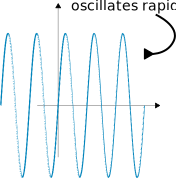

+++
title = "Linear Analysis"
description = "Normed and Banach spaces, Baire category theorem & applications, spaces of continuous functions, Hilbert spaces, spectral theory."

[extra]
part = "Part II"
term = "Mich"
year = "2025"
lecturer = "Dr András Zsák"
color = "#ffe0d6"
image = "notes/linear-analysis/thumbnail.svg"
unfinished = true
+++

## Normed Spaces

### Definitions and examples


Let $X$ be a (real or complex) vector space. A **norm** on $X$ is a function $\lVert \cdot \rVert : X \to \mathbb{R}$ such that

1. $\lVert x \rVert \geq 0 \quad \forall x \in X$, with equality iff $x = 0$ &nbsp;(positivity);
2. $\lVert \lambda x \rVert = |\lambda|\ \lVert x \rVert \quad \forall x \in X$ and scalars $\lambda$ &nbsp;(homogeneity);
3. $\lVert x + y \rVert \leq \lVert x \rVert + \lVert y \rVert \quad \forall x, y \in X$ &nbsp;(triangle inequality).

$\lVert x \rVert$ is called the **norm** or **length** of $x$.

A **normed space** is a pair $(X, \lVert \cdot \rVert)$ where $X$ is a vector space and $\lVert \cdot \rVert$ is a norm on $X$.


#### Examples



1. $\ell_2^n \coloneqq (\mathbb{R}^n, \lVert \cdot \rVert_2)$ (or $(\mathbb{C}^n, \lVert \cdot \rVert_2)$), where
    $$\lVert x \rVert_2 \coloneqq \left(\sum_{i=1}^n |x_i|^2 \right)^{1/2}$$
    for $x = (x_1, \dots, x_n) \in \mathbb{R}^n$ (the **$\ell_2$-norm** or **Euclidean norm**).

    Check the three properties: (i), (ii) are easy; (iii) follows from Cauchy–Schwarz.

2. $\ell_1^n \coloneqq (\mathbb{R}^n, \lVert \cdot \rVert_1)$, where $\lVert x \rVert_1 \coloneqq \sum_{i=1}^n |x_i|$ (the **$\ell_1$-norm**).

    (i), (ii) easy; (iii): $|x_i + y_i| \leq |x_i| + |y_i|$, sum over $i$.

3. $\ell_{\infty}^n \coloneqq (\mathbb{R}^n, \lVert \cdot \rVert_{\infty})$, where $\lVert x \rVert_{\infty} \coloneqq \max_{1 \leq i \leq n} |x_i|$ (the **$\ell_{\infty}$-norm** or **sup-norm**).

    (i), (ii), (iii) easy.



Given a normed space $X$, its norm $\lVert \cdot \rVert$ induces a metric $d$ on $X$:
$$d(x,y) = \lVert x-y \rVert$$



$d(x,y) \geq 0, =0 \iff x-y = 0 \iff x=y \quad \checkmark$

$d(y,x) = \lVert y-x \rVert = \lVert (-1)(x-y) \rVert = \lVert x-y \rVert = d(x,y) \quad \checkmark$

$d(x,z) = \lVert x-z \rVert = \lVert (x-y)-(y-z) \rVert \leq \lVert x-y \rVert + \lVert y-z \rVert = d(x,y) + d(y,z) \quad\checkmark$



Then $d$ induces a topology on $X$ called the **norm topology** of $X$. We can now talk about continuity e.g. the algebraic operations are (sequentially) continuous:

- If $x_n \to x, y_n \to y$ in $X$ then $x_n + y_n \to x+y$
- If $x_n \to x, \lambda_n \to \lambda$ in scalar field, then $\lambda_n x_n \to \lambda x$.

Also the norm $\lVert \cdot \rVert : X \to \mathbb{R}$ is continuous since $\Big| \lVert x \rVert - \lVert y \rVert \Big| \leq \lVert x-y \rVert$ by reverse triangle inequality, so $\lVert \cdot \rVert$ is even 1-Lipschitz.


A **Banach space** is a complete normed space, i.e. a normed space that is complete in its norm topology.


For example, $\ell_2^n, \ell_1^n, \ell_\infty^n$ are complete, because we can look coordinate-wise: $x^{(k)} \to x$ in one of these spaces $\iff x_i^{(k)} \to x_i \\;\forall\\; 1 \leq i \leq n$, and $(x^{(k)})\_{k=1}^\infty$ is Cauchy iff $(x_i^{(k)})\_{k=1}^\infty$ is Cauchy for each $i = 1, \dots, n$.

In a normed space $X$, a useful object is the **unit ball** $B_X \coloneqq \\{ x \in X \mid \lVert x \rVert \leq 1\\}$.

  
  
  


Sidenote: did I accidentally create an optical illusion? The axes seem all wonky...


#### Remarks

- $B_X$ determines the norm: $\lVert x \rVert = \inf\\{ t \geq 0 \mid x \in t B_X\\}$.
- $B_X$ is symmetric, convex, and closed: $x \in B_X \iff -x \in B_X$, and if $x,y \in B_X, t \in [0,1]$, then $(1-t)x + ty \in B_X$, since $\lVert (1-t)x + ty\rVert \leq (1-t)\lVert x \rVert + t \lVert y \rVert \leq 1$.
- If $B \subset \mathbb{R}^n$ is a closed, convex, symmetric, bounded neighbourhood of 0, then $B$ is the unit ball of $(\mathbb{R}^n, \lVert \cdot \rVert)$ for some norm $\lVert \cdot \rVert$.

#### More Examples


4. $\ell_p^n \coloneqq (\mathbb{R}^n, \lVert \cdot \rVert_p)$, where $1 \leq p < \infty$, $\lVert x \rVert_p \coloneqq \left(\sum_{i=1}^n |x_i|^p\right)^{1/p}$ (the **$\ell_p$-norm**).

    (i), (ii) easy, (iii) not obvious (done later; see {{ref(label="minkowski")}}).

5. Let $S$ denote the set of all scalar sequences. This is a vector space in the coordinate-wise operations: $(x_n) + (y_n) = (x_n + y_n), \lambda \cdot (x_n) = (\lambda x_n)$.

    $\ell_1 \coloneqq \Big\\{(x_n) \in S \\;\Big|\\; \sum_{n=1}^{\infty} |x_n| < \infty\Big\\},\\; \lVert (x_n) \rVert_1 \coloneqq \sum_{n=1}^\infty |x_n|$ (the **$\ell_1$-norm**).

    (i), (ii) easy. (iii): given $x = (x_n), y = (y_n) \in \ell_1$,

    - $|x_n + y_n| \leq |x_n| + |y_n| \\;\forall\\; n \in \mathbb{N}$.
    - Sum over $n \in \mathbb{N}$ to get that $x + y \in \mathbb{\ell_1}$ and $\lVert x + y \rVert_1 \leq \lVert x \rVert_1 + \lVert y \rVert_1$.

    So $\ell_1$ is a subspace of $S$ and $\lVert \cdot \rVert_1$ is a norm on $\ell_1$.

6. $\ell_2 \coloneqq \Big\\{(x_n) \in S \\;\Big|\\; \sum_{n=1}^{\infty} |x_n|^2 < \infty\Big\\},\\; \lVert (x_n) \rVert_2 \coloneqq \left(\sum_{n=1}^\infty |x_n|^2 \right)^{1/2}$ (the **$\ell_2$-norm**).

    (i), (ii) easy. (iii): given $x = (x_n), y = (y_n) \in \ell_2$,

    - $\left(\sum_{k=1}^n |x_k+y_k|^2\right)^{1/2} \leq \left(\sum_{k=1}^n |x_k|^2\right)^{1/2} + \left(\sum_{k=1}^n |y_k|^2\right)^{1/2}$ by triangle inequality in $\ell_2^n$.
    - Let $n \to \infty$: get that $x + y \in \mathbb{\ell_2}$ and $\lVert x + y \rVert_2 \leq \lVert x \rVert_2 + \lVert y \rVert_2$.

    So $\ell_2$ is a subspace of $S$ and $\lVert \cdot \rVert_2$ is a norm on $\ell_2$.

    More generally, for $1 \leq p < \infty$, $\ell_p \coloneqq \Big\\{(x_n) \in S \mid \sum_{n=1}^\infty |x_n|^p < \infty \Big\\}$ is a subspace of $S$ and $\lVert (x_n) \rVert_p \coloneqq \left(\sum_{n=1}^\infty |x_n|^p \right)^{1/p}$ is a norm (the **$\ell_p$-norm**) on $\ell_p$ (once we have the triangle inequality in $\ell_p^n$, which we will do soon; see {{ref(label="minkowski")}}).

7. $\ell_\infty \coloneqq \Big\\{(x_n) \in S \\;\Big|\\; \exists M \geq 0 \quad \forall n \quad |x_n| \leq M \Big\\},\\; \lVert (x_n) \rVert_\infty \coloneqq \sup_{n \in \mathbb{N}} |x_n|$ (the **$\ell_\infty$-norm** or **sup-norm**).

    (i), (ii) easy. (iii): given $x = (x_n), y = (y_n) \in \ell_\infty$,

    - $|x_n + y_n| \leq |x_n| + |y_n| \leq \lVert x \rVert_\infty + \lVert y \rVert_\infty \\;\forall\\; n \in \mathbb{N}$.
    - So $x+y \in \ell_\infty$ and $\lVert x+y \rVert_\infty \leq \lVert x \rVert_\infty + \lVert y \rVert_\infty$.

8. $c_0 \coloneqq \Big\\{(x_n) \in S \\;\Big|\\; x_n \to 0 \text{ as } n \to \infty \Big\\}$

    $c \coloneqq \Big\\{(x_n) \in S \\;\Big|\\; \lim_{n \to \infty} x_n \text{ exists} \Big\\}$

    These are subspaces of $\ell_\infty$ and hence normed spaces in $\lVert \cdot \rVert_\infty$.



Examples 5-8 are called **sequence spaces**. They are "infinite-dimensional analogues" of examples 1-4.

### Inequalities of Minkowski and Hölder


We aim at proving these two ubiquitous inequalities. Minkowski is just the triangle inequality for $\ell_p^n$, and Hölder is a generalisation of Cauchy-Schwarz.


Recall that a function $f : (0, \infty) \to \mathbb{R}$ is **convex** if $\forall\\; x,y \in (0,\infty)$ and $\forall\\; t \in [0,1]$,
$$f((1-t)x+ty) \leq (1-t)f(x) + tf(y)$$
and **concave** if $\geq$.


Let $1 \leq p < \infty$. Then $x \mapsto x^p: (0,\infty) \to \mathbb{R}$ is convex.




We need to show $((1-t)x + ty)^p \leq (1-t)x^p + ty^p \\;\forall\\; x,y \in (0,\infty) \\;\forall\\; t \in [0,1]$.

Fix $y > 0, t \in [0,1]$. Define $g(x)$ to be the difference:

$$g(x) = \left((1-t)x + ty\right)^p - \left((1-t)x^p + ty^p\right),\quad x > 0.$$

Want $g(x) \leq 0 \\;\forall\\; x > 0$, then done.

$$g'(x) = p(1-t)\left((1-t)x + ty\right)^{p-1} - p(1-t)x^{p-1}.$$

If $0 < x < y$ then $g'(x) \geq 0$. If $y < x$ then $g'(x) \leq 0$. In either case, by MVT have $g(x) \leq g(y) = 0 \\;\forall\\; x \in (0, \infty)$.



Let $1 \leq p < \infty$, $n \in \mathbb{N}$. For $x,y \in \mathbb{R}^n$ (or $\mathbb{C}^n$),
$$\lVert x + y \rVert_p \leq \lVert x \rVert_p + \lVert y \rVert_p$$


(This shows that $\ell_p^n = (\mathbb{R}^n, \lVert\cdot\rVert_p)$ and $(\ell_p, \lVert\cdot\rVert_p)$ are normed spaces.)


Let $B = \\{x \in \mathbb{R}^n \mid \lVert x \rVert_p \leq 1\\}$. We will show $B$ is a convex set later (necessary). Then we complete the proof as follows:

Let $x,y \in \mathbb{R}^n$. *Need* $\lVert x+y \rVert_p \leq \lVert x \rVert_p + \lVert y \rVert_p$. WLOG $x,y,x+y$ nonzero.

$$\begin{aligned}
\frac{x+y}{\lVert x \rVert_p + \lVert y \rVert_p} &= \frac{\lVert x \rVert_p}{\lVert x \rVert_p + \lVert y \rVert_p} \cdot \frac{x}{\lVert x \rVert_p} + \frac{\lVert y \rVert_p}{\lVert x \rVert_p + \lVert y \rVert_p} \cdot \frac{y}{\lVert y \rVert_p}\\\\
& \in B \text{ since convex combination of elts of } B.
\end{aligned}$$ 

Hence $\lVert \frac{x+y}{\lVert x \rVert_p + \lVert y \rVert_p} \rVert_p \leq 1$, so $\lVert x+y \rVert_p \leq \lVert x \rVert_p + \lVert y \rVert_p \\; \checkmark$

- To show $B$ is convex: let $x,y \in B, t \in [0,1]$. *Need* $(1-t)x + ty \in B$.

    For $1 \leq k \leq n$,
    $$|(1-t)x_k + ty_k|^p \leq \left((1-t)|x_k| + t |y_k| \right)^p \leq (1-t) |x_k|^p + t|y_k|^p$$
    where the second inequality is by {{ref(label="x^p-is-convex")}} if $x_k \neq 0, y_k \neq 0$, otherwise trivial.

    Sum over $k$:

    $$\lVert (1-t)x + ty \rVert_p^p \leq (1-t) \underbrace{\lVert x \rVert_p^p}\_{\leq 1} + t \underbrace{\lVert y \rVert_p^p}\_{\leq 1} \leq 1 \\; \checkmark$$ 

    So $(1-t)x + ty \in B$.



Show that $\ell_p, 1 \leq p \leq \infty$, is complete. (Slick proof later; see {{ref(label="dual-of-lp")}}).


Now onto Hölder.

Let $1 < p < \infty$. The **conjugate index** of $p$ is the unique $q$, $1 < q < \infty$, such that $\frac{1}{p} + \frac{1}{q} = 1$. For example if $p=2$ then $q=2$.


Let $ 1 < p,q < \infty$ with $\frac{1}{p} + \frac{1}{q} = 1$. Then $\forall a,b \geq 0,$
$$ab \leq \frac{a^p}{p} + \frac{b^q}{q}$$



WLOG $a>0, b>0$. Take log of both sides, and use concavity of log.



Let $ 1 < p,q < \infty$ with $\frac{1}{p} + \frac{1}{q} = 1$. Then for $x \in \ell_p, y \in \ell_q$, we have $x \cdot y = (x\_n y\_n) \in \ell\_1$ and
$$\lVert x \cdot y \rVert\_1 \leq \lVert x \rVert\_p \cdot \lVert y \rVert\_q$$


#### Remarks

- $p=1, q=\infty$ also works:
    - Let $x = (x_n) \in \ell_1, y = (y_n) \in \ell_\infty$. Then $\forall n$, $|x_n y_n| = |x_n| \cdot |y_n| \leq |x_n| \cdot \lVert y \rVert_\infty$.
    - So by comparison test, $x \cdot y = (x_n y_n) \in \ell_1$ and $\lVert x \cdot y \rVert_1 \leq \lVert x \rVert_1 \cdot \lVert y \rVert_\infty$.
- $p=q=2$ is Cauchy-Schwarz.


WLOG $x \neq 0, y \neq 0$. By homogeneity, WLOG $\lVert x \rVert_p = \lVert y \rVert_q = 1$.

By Young's inequality, $|x_n y_n| \leq \frac{|x_n|^p}{p} + \frac{|y_n|^q}{q} \\;\forall n$. Sum over $n$:
$$\begin{aligned}
\sum_{n=1}^\infty |x_n y_n| &\leq \frac{\lVert x \rVert_p^p}{p} + \frac{\lVert y \rVert_q^q}{q}\\\\
&= \frac{1}{p} + \frac{1}{q} = 1 = \lVert x \rVert_p \cdot \lVert y \rVert_q.
\end{aligned}$$



Deduce Minkowski from Hölder.


### More examples of normed spaces


9. $C[0,1] \coloneqq \big\\{f : [0,1] \to \mathbb{R} \mid f \text{ is continuous}\big\\}$, $\lVert f \rVert_\infty \coloneqq \sup_{x \in [0,1]} |f(x)|$ (**sup-norm** or **uniform norm**)

    This is a Banach space (recall uniform limit of cts fns is cts).

10. More generally, given a compact Hausdorff space $K$,
$$C(K) \coloneqq \big\\{f:K\to\mathbb{R} \mid f \text{ cts}\big\\}$$ 
is a Banach space in the sup-norm $\lVert f \rVert_\infty \coloneqq \sup_{x \in K} |f(x)|$.
(We will look at compact Hausdorff spaces in depth later.)

11. $C[0,1]$ with the **$L^1$-norm** $\lVert f \rVert_1 \coloneqq \int_0^1 |f(t)| dt, f \in C[0,1]$

    

      

    This is a normed space, but is incomplete:

      

      
    

    More generally, $C[0,1]$ is incomplete in the **$L^p$-norm**, $1 \leq p < \infty$, $\lVert f \rVert_p \coloneqq \left(\int_0^1 |f(t)|^p dt\right)^{1/p}$ (same counterexample).

    $\big[$ In II Prob & Measure, the completion of $\left(C[0,1], \lVert \cdot \rVert_p\right)$ is $L^p[0,1]$ $\big]$

12. $C^1[0,1] \coloneqq \big\\{ f \in C[0,1] \mid f \text{ ctsly diffble} \big\\} \subseteq C[0,1]$ is a subspace. So it's a normed space in $\lVert \cdot \rVert_\infty$, but is incomplete, i.e. not closed in $C[0,1]$.

    It *is* complete in the norm $\lVert f \rVert = \lVert f \rVert_\infty + \lVert f' \rVert_\infty$ (see example sheet 1).

13. $\Delta \coloneqq \big\\{ z \in \mathbb{C} \mid |z| \leq 1 \big\\}$

    $A(\Delta) \coloneqq \big\\{ f \in C(\Delta) \mid f \text{ analytic on int}(\Delta) \big\\}$ is a subspace of $C(\Delta)$, and a closed space [uniform limit of holomorphic fns is holomorphic], hence a Banach space in $\lVert \cdot \rVert_\infty$.



### More on the normed topology

Let $X$ be a normed space, $A \subseteq X$ subset. Recall the **closure** of $A$ is $\overline{A} = \big\\{ x \in X \mid \exists (a_n) \in A \text{ such that } a_n \to x \text{ as } n \to \infty \big\\}$.

Say $A$ is **dense** in $X$ if $\overline{A} = X$. (Equivalently, $A$ intersects every nonempty open set.)

Say $X$ is **separable** if it has a countable dense subset. (For a metric space, this is equivalent to being second countable.)

If $Y \subseteq X$ is a (vector) subspace,  then so is $\overline{Y}$: if $x,y \in \overline{Y}$, then
- $\exists (x_n), (y_n) \in Y$ s.t. $x_n \to x, y_n \to y$.
- So  $\lambda x_n + \mu y_n \to \lambda x + \mu y \in \overline{Y}$.

Similarly, if $A \subseteq X$ is convex, then so is $\overline{A}$.


For a subset $A$ of a normed space $X$, the **closed linear span** of $A$, denoted $\overline{\text{span}} A$, is $\overline{\text{span} A}$, which is a closed subspace of $X$.


Note: if $A$ is countable then $\overline{\text{span}} A$ is separable: take the set of all rational linear combinations of elements of $A$; this is countable and dense in $\overline{\text{span}A}$.

#### Examples

- $\overline{\mathbb{Q}} = \mathbb{R}$, so $\mathbb{R}$ is separable.
- $\ell_p, 1 \leq p < \infty$, is separable: let
    $$\begin{aligned}
    e\_n &\coloneqq (0, \dots, 0, \underbrace{1}\_{n^{th}\text{ space}}, 0, \dots), n \in \mathbb{R}\\\\
    c\_{00} &\coloneqq \text{span}\\{e\_n \mid n \in \mathbb{N}\\}\\\\
    &= \\{(x_n) \in S \mid x_n \text{ is eventually constantly } 0\\}
    \end{aligned}$$

    
    $c = \big\\{\text{limit exists}\big\\}$, $c_0 = \big\\{\text{limit is 0}\big\\}$, $c_{00} = \big\\{\text{eventually constantly 0}\big\\}$
    

    Then $\ell_p = \overline{\text{span}}\\{e_n \mid n \in \mathbb{N}\\}$: for $x = (x_n) \in \ell_p$, we can approximate by "matching elements left-to-right":
    $$\lVert x - \sum_{i=1}^n x_i e_i \rVert_p = \left(\sum_{i > n} |x_i|^p\right)^{1/p} \to 0 \text{ as } n \to \infty.$$

- Similarly, in $\ell_\infty$, $\overline{c_{00}} = \overline{\text{span}}\\{e_n \mid n \in \mathbb{N}\\} = c_0$ (see example sheet 1).
- $c_0$ is separable, by the above note. ($c_0 = \overline{c_{00}}$, $c_{00}$ countable)
- $\ell_\infty$ is *not* separable. (it contains unctble collection of disjoint open sets; see example sheet 1)

### Bounded linear maps


Let $X,Y$ be normed spaces and $T: X \to Y$ a linear map. The following are equivalent:
1. $T$ is cts at 0
2. $T$ is cts
3. $T$ is Lipschitz
4. T is **bounded** i.e. $\exists C \geq 0$ s.t. $\forall x \in X, \lVert Tx \rVert \leq C \lVert x \rVert$



(iv) $\implies$ (iii): $\lVert Tx - Ty \rVert = \lVert T(x-y) \rVert \leq C\lVert x-y \rVert$

(iii) $\implies$ (ii): immediate

(ii) $\implies$ (i): obvious

(i) $\implies$ (iv):

- $\exists \delta > 0$ s.t. $\forall x \in X,$ if $\lVert x \rVert \leq \delta$ then $\lVert Tx-T0 \rVert = \lVert Tx \rVert\leq 1$.

- For $x \neq 0$, $\frac{\delta x}{\lVert x \rVert} = \delta$, so $\Big\lVert T\left(\frac{\delta x}{\lVert x \rVert}\right) \Big\rVert \leq 1$, which implies $\lVert Tx \rVert \leq \frac{1}{\delta} \lVert x \rVert$.


For normed spaces $X$ and $Y$, let
$$\mathcal{B}(X,Y) \coloneqq \big\\{T: X \to Y \mid T \text{ linear and bounded}\big\\}$$ 
and for $T \in \mathcal{B}(X,Y)$, we define its **operator norm** $\lVert T \rVert := \sup \big\\{ \lVert Tx \rVert \mid x \in B_X \big\\}$.


This is very useful; it tells us how to actually compute operator norms. Easy to prove:
- We have some $C \geq 0$ such that $\forall x, \lVert Tx \rVert \leq C \lVert x \rVert$. So if $\lVert x \rVert \leq 1$, then $\lVert Tx \rVert \leq C$. So $\lVert T \rVert \leq C$ (since sup = least upper bound).
- Conversely, $\forall x \in B_X, \lVert Tx \rVert \leq \lVert T \rVert$, so by homogeneity $\lVert Tx \rVert \leq \lVert T \rVert \cdot \lVert x \rVert$. So $\lVert T \rVert$ is such a $C$.


The operator norm is a norm on $\mathcal{B}(X,Y)$: given $S,T \in \mathcal{B}(X,Y), \forall x \in X$ we have
    $$\lVert (S+T)x \rVert = \lVert Sx + Tx \rVert \leq (\lVert S \rVert + \lVert T \rVert)\lVert x \rVert$$
    $$\implies S+T \in \mathcal{B}(X,Y) \text{ and } \lVert S+T \rVert \leq \lVert S \rVert + \lVert T \rVert.$$

**Notation**: $\mathcal{B}(X)$ for $\mathcal{B}(X,X)$.


Let $X,Y,Z$ be normed spaces, $S \in \mathcal{B}(X,Y), T \in \mathcal{B}(Y,Z)$, then $TS \in \mathcal{B}(X,Z)$ and $\lVert TS \rVert \leq \lVert T \rVert \cdot \lVert S \rVert$.



$\forall x \in X, \lVert TSx \rVert \leq \lVert T \rVert \cdot \lVert Sx \rVert \leq \lVert T \rVert \cdot \lVert S \rVert \cdot \lVert x \rVert$


#### Examples


1. $T: \ell_2^n \to \ell_2^n,\\; T(x_1, \dots, x_n) = (x_1, \dots, x_r, 0, \dots, 0), 1 \leq r \leq n$.

    $\lVert Tx \rVert_2 = \left(\sum_{i=1}^r |x_i|^2\right)^{1/2} \leq \lVert x \rVert_2$. So $\lVert T \rVert \leq 1$.

    But $Te_1 = e_1$, so $\lVert T \rVert = 1$.

    More generally, if $T$ has matrix $A = (a_{ij})$ w.r.t. standard basis, then $\lVert T \rVert \leq \left(\sum_{i,j=1}^n |a_{ij}|^2\right)^{1/2}$ by Cauchy-Schwarz.

2. Let $1 \leq p \leq \infty,\\; R: \ell_p \to \ell_p, R(x_1, x_2, \dots) = (0, x_1, x_2, \dots)$ (the **right-shift**).

    $\forall x \in \ell_p, \lVert Rx \rVert_p = \lVert x \rVert_p$. So $R$ is isometric and $\lVert R \rVert = 1$.

    $R$ is injective but not surjective.

3. Let $1 \leq p \leq \infty,\\; L: \ell_p \to \ell_p, L(x_1, x_2, \dots) = ((x_2, x_3, \dots)$ (the **left-shift**).

    $\forall x \in \ell_p, \lVert Rx \rVert_p \leq \lVert x \rVert_p$. So $L \in \mathcal{B}(\ell_p), \lVert L \rVert \leq 1$. As $Le_2 = e_1, \lVert L \rVert = 1$.

    $L$ is surjective but not injective; $LR = Id \neq RL$.

4. $T : \ell_1 \to \ell_2, Tx = x$.

    *Claim:* $\ell_1 \subseteq \ell_2$ and for $x \in \ell_1, \lVert x \rVert_2 \leq \lVert x \rVert_1$. Indeed, WLOG $\lVert x \rVert_1 = 1$ by homogeneity, so $\sum |x_i| = 1$ and $|x_i| \leq 1 \\;\forall\\; i$; hence $|x_i|^2 \leq |x_i| \forall i$, so  $\lVert x \rVert_2^2 \leq \lVert x_1 \rVert = 1$.

    Thus $T \in \mathcal{B}(\ell_1, \ell_2)$ and $\lVert T \rVert = 1$ (e.g. $Te_1 = e_1, \lVert e_1 \rVert_2 = \lVert e_1 \rVert_1 = 1).$

5. $T: \ell_2 \to \ell_1, T((x_n)) = \left(\frac{x_n}{n}\right).$ By Cauchy-Schwarz, $\sum \frac{|x_n|}{n} \leq \left(\sum |x_n|^2\right)^{\frac{1}{2}} \left(\sum \frac{1}{n^2}\right)^{\frac{1}{2}}$

    So $T \in \mathcal{B}(\ell_2, \ell_1)$ and $\lVert T \rVert \leq \left( \sum \frac{1}{n^2} \right)^{\frac{1}{2}}$; in fact we have equality by equality in C-S (set $x_n = \frac{1}{n}$)

6. $D : \left(C^1[0,1], \lVert \cdot \rVert\right) \to \left(C[0,1], \lVert \cdot \rVert_\infty \right), Df = f'$.

    $D$ is bounded: $\lVert Df \rVert_\infty = \lVert f' \rVert_\infty \leq \lVert f' \rVert_\infty + \lVert f \rVert_\infty = \lVert f \rVert$. So $\lVert D \rVert \leq 1$.

    

      

    To show equality, take $f(x) = \sin(n \pi x)$, then $\lVert Df \rVert_\infty = \pi n, \lVert f \rVert = \pi n + 1$. Thus $\lVert D \rVert = 1$ (take $n$ arb. large).

      

      
    

    For $f \neq 0, \lVert Df \rVert < \lVert f \rVert$. But still, $\lVert D \rVert = 1$.

7. On a normed space $X$, the identity $x \mapsto x$ is denoted by $Id, I, Id_X$ or $I_X$. This is isometric i.e. $\lVert Id(x) \rVert = \lVert x \rVert \\;\forall x.$

8. For normed spaces $X,Y$, we let
$$X \oplus Y \coloneqq \big\\{ (x,y) \mid x \in X, y \in Y\big\\}$$ 
with norm $\lVert (x,y) \rVert_1 \coloneqq \lVert x \rVert + \lVert y \rVert$. The corresponding norm topology is the product topology.




Let $X,Y$ be normed spaces.

An **isomorphism** $X \to Y$ is a linear homeomorphism $T: X \to Y$, i.e. $T$ is a linear bijection s.t. $T$ and $T^{-1}$ are bounded. Equivalently, $T$ is a linear bijection and $\exists a>0, b>0 \text{ s.t. } \forall x \in X, a\lVert x \rVert \leq \lVert Tx \rVert \leq b \lVert x \rVert.$

If such a $T$ exists, say $X$ and $Y$ are **isomorphic** and write $X \sim Y$.

An **isometric isomorphism** is a linear bijection  $T: X \to Y$ s.t. $\forall x \in X, \lVert Tx \rVert = \lVert x \rVert$ (i.e. a = b = 1 in the above); if one exists we write $X \cong Y$.

An **isomorphic embedding** $X \to Y$ is a linear map $T: X \to Y$ s.t. $T: X \to TX$ is an isomorphism. If such a $T$ exists, we say $X$ (isomorphically) **embeds into** $Y$, and write $X \hookrightarrow Y$.




Let $X$ be a vector space. Two norms $\lVert \cdot \rVert, \lVert \cdot \rVert'$ on $X$ are **equivalent** if $Id: (X, \lVert \cdot \rVert) \to (X, \lVert  \rVert')$ is an isomorphism.
$$\begin{aligned}
\iff& \lVert \cdot \rVert, \lVert \cdot \rVert' \text{ induce the same topology on } X\\\\
\iff& \exists a>0, b>0 \text{ s.t. } a \lVert x \rVert \leq \lVert x \rVert' \leq b \lVert x \rVert \forall x \in X\\\\
&\text{i.e. } aB_X \subseteq B_{X'} \subseteq b B_X
\end{aligned}$$

For example, $\ell_1^2$ and $\ell_2^2$ are equivalent:

{{ figure(width="300px", src="ball_sandwich.svg") }}


#### Remarks


1. If $X \sim Y$, then $X$ complete $\iff Y$ complete.

    If $\lVert \cdot \rVert, \lVert \cdot \rVert'$ are equivalent norms on a vector space $X$, then $(X,\lVert \cdot \rVert)$ is complete iff $(X, \lVert \cdot \rVert')$ is complete.

    (Isomorphisms preserve completeness, since bilipschitz bijection)

2. Given normed spaces $X,Y$, on $X \oplus Y$ the norm $\lVert (x,y) \rVert_1 = \lVert x \rVert + \lVert y \rVert$ is equivalent to
$$\lVert (x,y) \rVert_p \coloneqq \left(\lVert x \rVert_p + \lVert y \rVert_p \right)^{\frac{1}{p}} \\; (1 \leq p < \infty)$$ 
$$\text{\\& to } \lVert (x,y) \rVert_\infty \coloneqq \max\\{\lVert x \rVert, \lVert y \rVert\\}$$

3. On $C[0,1]$, $\lVert \cdot \rVert_\infty$ is complete and $\lVert \cdot \rVert_1$ is incomplete. So $\lVert \cdot \rVert_\infty \nsim \lVert \cdot \rVert_1$. (There does exist an easy direct proof)

    However $\lVert f \rVert_1 = \int_0^1 |f(t) dt \leq \lVert f \rVert_\infty$.

    So $Id: (C[0,1], \lVert \cdot \rVert_\infty \to (C[0,1], \lVert \cdot \rVert_1)$ is a cts linear bijection, but its inverse is not cts.

4. On $c_{00} = \text{span}\\{e_n \mid n \in \mathbb{N}\\}, \lVert \cdot \rVert_1 \nsim \lVert \cdot \rVert_2$:

    Take $x = (1, 1, \dots, 1, 0, \dots)$, then $\lVert x \rVert_1 = n, \lVert x \rVert_2 = \sqrt n$.


**Note** Let $X,Y$ be normed spaces. In $\mathcal{B}(X,Y)$, convergence implies pointwise convergence (easy to check), i.e. if $T_n \to T$ in $\mathcal{B}(X,Y)$ then $\forall x \in X, T_n x \to Tx$ in $Y$. The converse is false in general, e.g. take $T_n: \ell_1 \to \mathbb{R}, T_n x = x_n$, then $T_n \to 0$ pointwise but $\lVert T_n \rVert = 1 \\;\forall n$ (as $T_n(e_n) = 1$).


Let $X,Y$ be normed spaces. If $Y$ is complete then $\mathcal{B}(X,Y)$ is complete.




Slogan: Cauchy $\implies$ ptwise Cauchy $\implies$ ptwise conv, then show ptwise limit is actually a uniform limit.


Let $(T_n)$ be a Cauchy sequence in $\mathcal{B}(X,Y)$.

Fix $x \in X$. Then $\lVert T_n x - T_m x \rVert \leq \lVert T_n - T_m \rVert \lVert x \rVert \to 0$ as $m,n \to \infty$. So $(T_n x)$ is Cauchy in $Y$, and hence convergent.

Hence we may define $T: X \to Y$, $Tx \coloneqq \lim_{n \to \infty} T_n x$.

- **$T$ linear:**
$$\begin{aligned}
T(\lambda x + \mu y) &= \lim_{n \to \infty} \left(T_n(\lambda x + \mu y)\right)\\\\
&= \lim_{n \to \infty} (\lambda T_n x + \mu T_n y)\\\\
&= \lambda \lim_{n \to \infty} T_n x + \mu \lim_{n \to \infty} T_n y\\\\
&= \lambda Tx + \mu Ty \\;\checkmark
\end{aligned}$$

- **$T$ bounded:**
    - $(T_n)$ is Cauchy and so bounded: $\exists M \geq 0$ s.t.  $\forall n, \lVert T_n \rVert \leq M$.
    - Fix $x \in X. \\;\forall n, \lVert T_n x \rVert \leq \lVert T_n \rVert \lVert x \rVert \leq M \lVert x \rVert.$
    - Let $n \to \infty \implies \lVert Tx \rVert \leq M \lVert x \rVert. \\;\checkmark$

- **$T_n \to T$ in operator norm:**
    - Let $\varepsilon > 0$, then $\exists N \in \mathbb{N}$ s.t. $\forall m,n \geq N, \lVert T_n - T_m \rVert \leq \varepsilon$.
    - Fix $x \in X$. Then $\lVert T_n x - T_m x \rVert \leq \varepsilon \lVert x \rVert \\;\forall m,n \geq N.$
    - Keep $x$ and $n$ fixed, and let $m \to \infty. \implies \lVert T_n x - Tx \rVert \leq \varepsilon \lVert x \rVert$.
    - Hence $\lVert T_n - T \rVert \leq \varepsilon$ for all $n$ suff large.


## Dual Spaces

Let $X$ be a normed space. A **functional** on $X$ is a map $X \to $ scalar field.

The **dual space** $X^\*$ of $X$ is the space of all bounded linear functionals on $X$, i.e. $X^* = \mathcal{B}(X,\mathbb{R})$, with the operator norm (recall: for $f \in X^\*, \lVert f \rVert = \sup \big\\{|f(x)| : x \in X, \lVert x \rVert \leq 1\big\\}$). Since the scalar field is complete, {{ ref(label="Xcomplete=>B(X,Y)complete") }} says that


For any normed space $X$, $X^*$ is a Banach space.


**Notation:** For $x \in X, f \in X^*$, let $\langle x,f\rangle = f(x)$.


It's a bilinear map, but the two arguments live in different spaces. Later we will see the Riesz representation theorem, which says that any linear functional $f$ on a Hilbert space $H$ is "represented" by a vector $y \in H$, which more precisely means that $f$ is the map that "dots with $y$": $f : x \mapsto \langle x,y\rangle$. Thus under this notation, $\langle x,f \rangle = \langle x,y \rangle$, the latter of which is an actual inner product. In other words, "$f$ is the same as its Riesz representer $y$".


**Note:** $0 \in X^*$. Anything else?


Let $X$ be a normed space, $Y \subseteq X$ a subspace, $g \in Y^\*$. Then $\exists f \in X^*$ s.t. $\left.f\right|_Y = g $ and $\lVert f \rVert = \lVert g \rVert$. In other words, we can extend functionals on $Y$ to functionals on $X$.



Let $X$ be a normed space, $x_0 \in X \setminus \\{0\\}$. Then $\exists f \in X^*, \lVert f \rVert = 1,$ s.t. $f(x_0) = \lVert x_0 \rVert.$



- For any $g \in B_{X^\*}, |g(x_0)| \leq \lVert g \rVert \cdot \lVert x_0 \rVert \leq \lVert x_0 \rVert$. The above corollary $\implies \exists f \in B_{X^\*}$ s.t. $f(x_0) = \lVert x_0 \rVert$.

    So $\lVert x_0 \rVert = \max \big\\{ |g(x_0)|: g \in B_{X^*} \big\\}.$ $f$ is a "**norming functional**" at $x_0$.

- Given $x \neq y \in X$, let $x_0 = x-y$, then the above corollary $\implies \exists f \in X^*$ s.y. $f(x) \neq f(y)$. Thus $X^\*$ "separates the points" in $X$.

- **Proof of {{ref(label="existence-of-norming-fnal")}}:** $Y \coloneqq \text{span}\\{x_0\\}, g(\lambda x_0) \coloneqq \lambda \lVert x_0 \rVert$. Then $g \in S_{Y^\*}, g(x_0) = \lVert x_0 \rVert.$ Apply Hahn-Banach.


### Dual space of $\ell_p$ 

For $1 \leq p < \infty$, recall $\ell_p = \overline{\text{span}}\\{e_n \mid n \in \mathbb{N}\\} = \overline{c_{00}}.$

$\forall f \in \ell_p^\*:$ for $x = (x_n) \in \ell_p, f(x) =
f(\lim_{n \to \infty} \sum_{k=1}^n x_k e_k) = \sum_{k=1}^\infty x_k f(e_k)$ by linearity.

So, $f$ corresponds to the sequence $y = (f(e_n))$, and $f$ is the map that "dots with $y$".

Through this correspondence ($y \leftrightarrow$ map that dots with $y$), we aim to show that $\ell_p^\* \cong \ell_q$, where $q$ is the conjugate index of $p \\;\left(\frac{1}{p} + \frac{1}{q} = 1\right)$.


Let $1 < p < \infty$ and let $\frac{1}{p} + \frac{1}{q} = 1$. Then $\ell_p^\*$ is isometrically isomorphic to $\ell_q$.



Fix $y = (y_n) \in \ell_q$. Define $\varphi_y: \ell_p \to \mathbb{R}$ by $\varphi_y(x) \coloneqq \sum_{n=1}^\infty x_n y_n$ where $x = (x_n)$; this converges by Hölder, and $\varphi_y$ linear bounded: $\lVert \varphi_y \rVert \leq \lVert y \rVert_q$. So $\varphi_y \in \ell_p^\*$.

Hence if we define $\varphi: \ell_q \to \ell_p^\*, y \mapsto \varphi_y$, we have $\varphi$ linear bdd with $\lVert \varphi \rVert \leq 1.$

We'll show $\varphi$ is the required isometric isomorphism; remains to check surjective and isometric.

**Isometric:**

- Need $\lVert \varphi_y \rVert = \lVert y \rVert_q$, i.e. that $\lVert \varphi_y \rVert \geq \lVert y \rVert_q$ (we already showed the other direction).
- WLOG $y \neq 0$. Define
$$x_n = \begin{cases}
\frac{|y_n|^q}{y_n} & \text{if } y_n \neq 0 \\\\
0 & \text{if } y_n = 0
\end{cases}$$ 

    $x \in \ell_p \\,? \\; \underbrace{\sum |x_n|^p = \sum |y_n|^{(q-1)/p} = \sum |y_n|^q = \lVert y \rVert_q^q < \infty}_{\text{i.e. } \lVert x \rVert_p^p = \lVert y \rVert_q^q} \\;\checkmark$

- Now, $x \neq 0$ (as $y \neq 0 $) $\implies \frac{x}{\lVert x \rVert_p} \in B_{\ell_p}$, so
$$\begin{aligned}
\lVert \varphi_y \rVert &\geq \varphi_y\left(\frac{x}{\lVert x \rVert_p}\right)\\\\
&= \frac{1}{\lVert x \rVert_p} \sum x_n y_n = \frac{1}{\lVert x \rVert_p} \sum |y_n|^q = \frac{\lVert y \rVert_q^q}{\lVert y \rVert_q^{q/p}} = \lVert y \rVert_q
\end{aligned}$$ 

    Hence $\lVert \varphi_y \rVert = \lVert y \rVert_q$ as required.


To show operator norm is $\leq$ something, just bound it, and to show $\geq$ something, pick out a specific input.


**Surjective:**

- Fix $f \in \ell_p^\*$. Seek $y \in \ell_q$ s.t. $f = \varphi_y$.

- As in the "correspondence" above, define $y_n = f(e_n) \\;(n \in \mathbb{N}), y = (y_n).$

    Is $y \in \ell_q \\; ?$
    - Set $x_n = \begin{cases} \frac{|y_n|^q}{y_n} & \text{if } y_n \neq 0, n \leq N\\\\ 0 & \text{ else} \end{cases}$
    - Then $x = (x_n) \in \ell_p$ so $f(x) = \sum_{n=1}^N x_n f(e_n) = \sum_{n=1}^N x_n y_n = \sum_{n=1}^N |y_n|^q \leq \lVert f \rVert \cdot \lVert x \rVert_p.$
    - Also $\lVert x \rVert_p = \left(\sum_{n=1}^N |x_n|^p\right)^{1/p} = \left(\sum_{n=1}^N |y_n|^{(q-1)p}\right)^{1/p} = \left(\sum_{n=1}^N |y_n|^q\right)^{1/p}$
    - Hence $\sum_{n=1}^N |y_n|^q \leq \lVert f \rVert \left(\sum_{n=1}^N |y_n|^q\right)^{1/p}$. Divide both sides to get $\left(\sum_{n=1}^N |y_n|^q \right)^{1/q} \leq \lVert f \rVert$. Let $N \to \infty \implies y \in \ell_q \\; \checkmark$

        (WLOG we didn't divide by 0, because if $\sum_{n=1}^N |y_n|^q = 0$ then it's true anyway)

- Now $f(e_n) = y_n = \varphi_y(e_n) \\;\forall n \in \mathbb{N}$
$$\implies f(x) = \varphi_y(x) \\;\forall x \in \text{span}\\{e_n \mid n \in \mathbb{N}\\} = c_{00} \quad \text{ by linearity}$$ 
$$\implies f(x) = \varphi_y(x) \\;\forall x \in \overline{\text{span}}\\{e_n \mid n \in \mathbb{N}\\} = \ell_p \quad \text{ by continuity}$$ 

So $f = \varphi_y$ as required.


In this proof we define $x_n = |y_n|^q / y_n$ twice, but one of the times we truncate the terms, so that we avoid the issue of dividing by infinity.


Hence $\ell_p^\* \cong \ell_q.$



#### Remarks

1. By analogous proofs, we also have $\ell_1^\* \cong \ell_\infty, c_0^\* \cong \ell_1$ (see example sheet 1).

    The proof also shows that $\ell_1$ embeds into $\ell_\infty^\*$ isometrically, but the proof of surjectivity breaks down since $\overline{\text{span}}\\{e_n \mid n \in \mathbb{N}\\} = c_0$ in $\ell_\infty$, but  $c_0 \subsetneq \ell_\infty$.

2. From the proof, can show that {{ref(label="existence-of-norming-fnal")}} holds for $\ell_p$.

3. We have shown $\ell_p, 1 \leq p \leq \infty$ are complete, as they are dual spaces. $c_0$ and $c$ are then complete because they're closed in $\ell_\infty$.

### Bidual

$X$ normed space. $X^{**} = (X^\*)^\* = \mathcal{B}(X^\*,\mathbb{R})$ is the **bidual** or **second dual** of $X$.

For $x \in X$, define $\hat{x}: X^\* \to \mathbb{R}$ by $\underbrace{\hat{x}(f) = f(x)}_{\langle f, \hat{x}\rangle = \langle x,f \rangle}$ for $f \in X^\*$.

This is linear and bdd: $|\hat{x}(f)| = |f(x)| \leq \lVert f \rVert \cdot \lVert x \rVert$ so $\hat{x} \in X^{**}, \lVert \hat{x} \rVert \leq \lVert x \rVert.$ 

So have $X \to X^{**}, x \mapsto \hat{x}$. This is linear: $\widehat{\lambda x + \mu y}(f) = f(\lambda x + \mu y) = \lambda f(x) + \mu f(y) = (\lambda \hat{x} + \mu \hat{y})(f).$ 



For $x \neq 0$, let $f \in X^\*$ be a norming functional at $x$ (by {{ref(label="existence-of-norming-fnal")}}), i.e. $\lVert f \rVert = 1, f(x) = \lVert x \rVert$. Then $\hat{x}(f) = f(x) = \lVert x \rVert$. Hence $\lVert \hat{x} \rVert = \lVert x \rVert$.

So the canonical map $X \to X^{\*\*}, x \mapsto \hat{x}$ is an isometric isomorphism into $X^{\*\*}$. If surjective, say $X$ is **reflexive**.


### Dual operators


Let $X,Y$ be normed spaces and fix $T \in \mathcal{B}(X,Y)$. The **dual operator** $T^\*$ of $T$ is the map $T^\*: Y^\* \to X^\*$ defined by $T^\*(g) = g \circ T$.


By {{ref(label="norm-of-product")}}, $T^*(g) = g \circ T \in X^\*$ and $\lVert T^\*(g) \rVert \leq \lVert g \rVert \cdot \lVert T \rVert$. So $T^\*$ is well-defined. It is clearly linear, and bounded with $\lVert T^\* \rVert \leq \lVert T \rVert$.

**Remark:** Recall that for $x \in X, f \in X^\*, \langle x,f \rangle = f(x).$ Note that $\langle\cdot,\cdot\rangle : X \times X^\* \to $ scalars is bilinear. For $x \in X, g \in Y^\*, \langle x,T^\*(g)\rangle = \langle T(x),g\rangle.$


$$\begin{aligned}
\lVert T^\* \rVert = \text{sup}\_{g \in B\_{Y^\*}} \lVert T^\* g \rVert &= \text{sup}\_{g \in B\_{Y^\*}} \text{sup}\_{x \in B\_X} |\langle x,T^\* g\rangle| \\\\
&= \text{sup}\_{g \in B\_X} \underbrace{\text{sup}\_{x \in B\_{Y^\*}} |\langle Tx,g\rangle|}_{ (*) }
\end{aligned}$$ 

But $(*) = \lVert Tx \rVert$ by {{ref(label="existence-of-norming-fnal")}}, thus $\lVert T^\* \rVert = \lVert T \rVert.$



Let $1 < p,q < \infty, \frac{1}{p}+\frac{1}{q}=1$. Consider $R: \ell_p \to \ell_p, R(x_1,x_2,\dots) = (0,x_1,x_2,\dots)$ (right shift). What is  $R^*:\ell_p^\* \to \ell_p^\*$?

Recall we have $\ell_p^\* \cong \ell_q$ ($y \leftrightarrow \varphi_y$, the map that dots with $y$). We can compute what $R^\*$ does to an arbitrary $\varphi_y \in \ell_p^*$:

$$\begin{aligned}
(R^*\varphi_y)(x) &=(\varphi_y \circ R)(x) \\\\
&=\sum\_{n=1}^\infty (Rx)\_ny_n \\\\
&=\sum\_{n=1}^\infty x\_ny_{n+1}.
\end{aligned}$$

Hence $R^*\varphi_y=\varphi_z$ where $z=(y_2,y_3,\dots)$.

So, thought of as $R^\*:\ell_q \to \ell_q$, we have that $R^\*$ is the left shift $L: \ell_q \to \ell_q,\\; L(y_1,y_2,\dots)=(y_2,y_3,\dots)$.


#### Properties


1. $(Id_X)^\* = Id_{X^\*}$

2. $(\lambda S + \mu T)^\* = \lambda S^\* + \mu T^\* \\;(S,T \in \mathcal{B}(X,Y), \\; \lambda,\mu \text{ scalars})$

    Indeed, for $g \in Y^\*, x \in X,$

    $$\begin{aligned}
    \langle x,(\lambda S + \mu T)^\* g\rangle = \langle (\lambda S + \mu T)x,g\rangle &= \langle\lambda Sx + \mu Tx,g\rangle\\\\
    &= \lambda \langle Sx,g\rangle + \mu\langle Tx,g\rangle\\\\
    &= \lambda \langle x,S^\*g\rangle + \mu\langle x,T^\*g\rangle\\\\
    &= \langle x,(\lambda S^\* + \mu T^\*)g\rangle
    \end{aligned}$$

    Since $x$ arbitrary, have $(\lambda S + \mu T)^\* g = (\lambda S^\* + \mu T^\*)g$

    Since $g$ arbitrary, have $(\lambda S + \mu T)^\* = \lambda S^\* + \mu T^\*$, as required.

3. $(ST)^\* = T^\* S^\* \\;(T \in \mathcal{B}(X,Y), S \in \mathcal{B}(Y,Z))$

    Indeed, $\langle x,(ST)^\* g\rangle = \langle (ST)x,g\rangle = \langle S(Tx),g\rangle = \langle Tx,S^\* g\rangle = \langle x,T^\*(S^\* g)\rangle = \langle x,(T^\*S^\*) g\rangle \\;\checkmark$


Our "inner product" notation has allowed us to "pretend we are working with Hilbert spaces and the adjoint map" and use the same proofs (see the Hilbert Spaces section) TODO


4. Let $T \in \mathcal{B}(X,Y)$. We have $T^\* \in \mathcal{B}(Y^\*,X^\*)$ and $T^{\*\*} = (T^\*)^\* \in \mathcal{B}(X^{\*\*},Y^{\*\*})$.

    

      

    The diagram commutes, i.e. $\widehat{Tx} = T^{\*\*}\hat{x} \\;\forall x \in X$.

      

      
    

    Indeed, for $x \in X$ and $g \in Y^\*,\quad\langle g,T^{\*\*}\hat{x}\rangle = \langle T^\* g,\hat{x}\rangle = \langle x,T^\*g\rangle = \langle Tx,g\rangle = \langle g,\widehat{Tx}\rangle\\;\checkmark$



**Note:** $ \raisebox{.5pt}{\textcircled{\footnotesize{1}}} + \raisebox{.5pt}{\textcircled{\footnotesize{3}}}$ show: $X \sim Y \implies X^\* \sim Y^\*$

## Finite-Dimensional Normed Spaces
